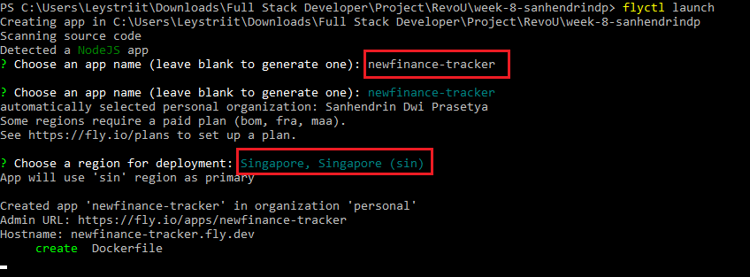
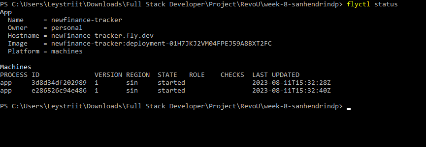
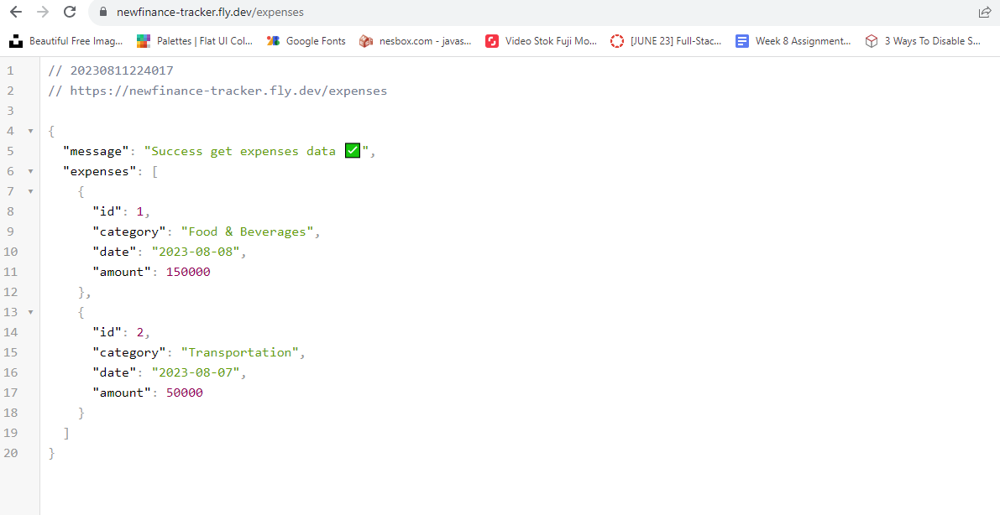
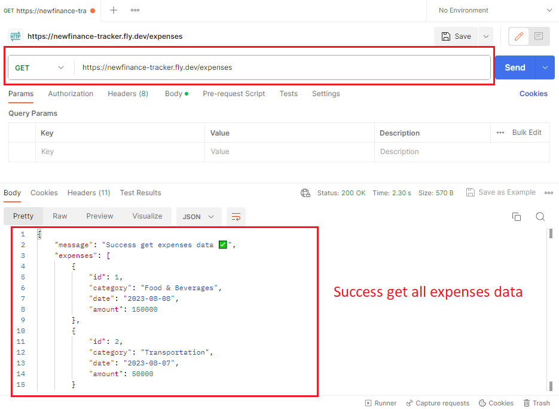

<h5 align="center">Link Project</h5>
<p align="center">
<a href="https://newfinance-tracker.fly.dev/">newfinance-tracker.fly.dev</a>
</p>

# Project Description

In week 7, a Financial Tracking app was already created. Now in week 8, we are trying to build a simple REST API server based on the Financial Tracking, so user can perform basic CRUD operations on the provided data.

# Preparation

To create this project, we want to install depedencies that we need for this project. First, we need to create Node.js project by using **npm init** in terminal. After that, install the dependecies, such as :

1. express.js and dotenv package:

```
npm i express dotenv
```

2. Install Typescript, @types/express, and @types/node package:

```
npm i -D typescript @types/express @types/node
```

3. Install nodemon as devDependencies:

```
npm i -D nodemon
```

4. Install concurrently as devDependencies:

```
npm i -D concurrently
```

5. Install body-parser:

```
npm i body-parser
```

6. Install @types/body-parser as devDependencies:

```
npm i -D @types/body-parser
```

7. Update the script in **package.json**:
<p align="center">
    
</p>

After all dependencies already installed to the project, generating tsconfig.json using **npx tsc --init** , then change outDir in tsconfig.json as: **"outDir": "./dist"**

# Deploy the REST API server with fly.io

After the REST API server already build, it's time to deploy it with fly.io. To use fly.io, we need to install it to our PC before we can use it.

1. Run the PowerShell, then use this command to install flyctl:

```
pwsh -Command "iwr https://fly.io/install.ps1 -useb | iex"
```

2. Sign in / Sign up to fly.io.
3. We need to authorize our login with PowerShell, so use this command:

```
flyctl auth login
```

4. Change the PowerShell directory to the project directory.
5. Launch the app using this command:

```
flyctl launch
```

6. Here, we can enter the name of the app and then select a region to deploy in.
<p align="center">
    
</p>

7. Finally, flyctl will ask you if you would like to deploy. Use this command:

```
flyctl deploy
```

8. After deploy is success, we can use command **flyctl status** to show the app basic detail.
<p align="center">
    
</p>

9. App successfully deployed.
<p align="center">
    
</p>

# Install Postman & test the APIs

To test the APIs, we need to install Postman so we can perform basic CRUD (Create, Read, Update, Delete) operations. The financial tracking API that has been created has endpoints with the following HTTP methods:

1. **GET**/expenses : Get all expenses data.
2. **GET**/expenses/:id : Get expense data by using ID.
3. **POST**/expenses : Create new expense data.
4. **PUT**/expenses/:id : Updates an existing data with the given ID.
5. **PATCH**/expenses/:id : Partially update an existing data with the given ID.
6. **DELETE**/expenses/:id : Delete an existing data with the given ID.

<p align="center">
    
    <br>
    <em>Postman with GET http request</em>
</p>

---

<p align="center">Thank you 🙏</p>
