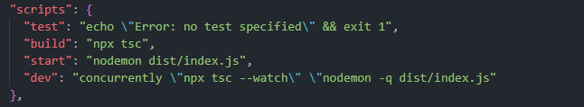

<h5 align="center">Website Link</h5>
<p align="center">
<a href="https://sanhendrindp.site/">sanhendrindp.site</a>
</p>

# Project Description

In week 7, a Financial Tracking app was already created. Now in week 8, we are trying to create a simple REST API server based on the Financial Tracking, so user can perform basic CRUD operations on the provided data.

# Preparation

To create this project, we want to install depedencies that we need for this project. First, we need to create Node.js project by using **npm init** in terminal. After that, install the dependecies, such as :

1. express.js and dotenv package:

```
npm i express dotenv
```

2. Install Typescript, @types/express, and @types/node package:

```
npm i -D typescript @types/express @types/node
```

3. Install nodemon as devDependencies:

```
npm i -D nodemon
```

4. Install concurrently as devDependencies:

```
npm i -D concurrently
```

5. Install body-parser:

```
npm i body-parser
```

6. Install @types/body-parser as devDependencies:

```
npm i -D @types/body-parser
```

7. Update the script in **package.json**:
<p align="center">
    
</p>

After all dependencies already installed to the project, generating tsconfig.json using **npx tsc --init** , then change outDir in tsconfig.json as: **"outDir": "./dist"**

<!-- # Install Postman & test APIs -->
